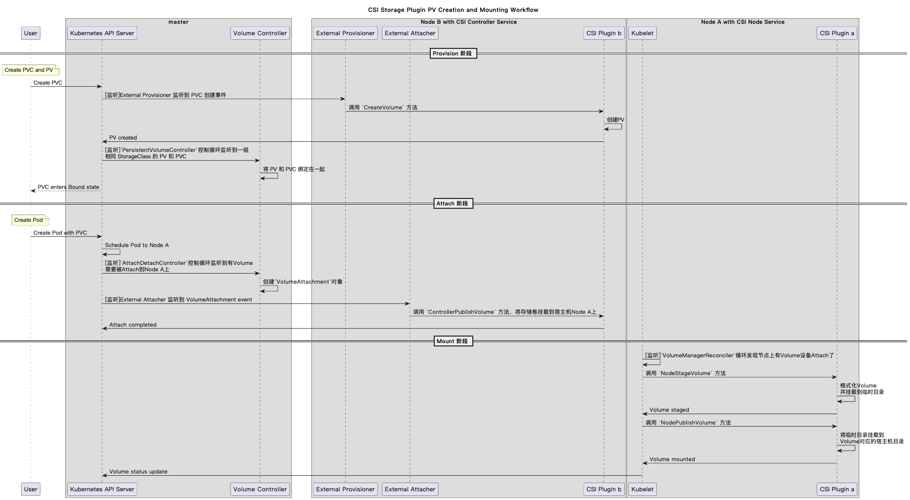

持久化存储

## 基本概念

- PVC

  PVC：PersistentVolumeClaim，是Pod希望使用的持久化存储的属性。比如，Volume的大小、可读写权限等。

- PV

  PV：PersistentVolume，持久化存储数据卷，这个 API 对象主要定义的是一个持久化存储在宿主机上的目录，比如一个 NFS 的挂载目录。

PVC类似于一个接口，PV类似于一个实现。两者依靠PersistentVolumeController来绑定（Bound）起来。当Pod声明的PVC（在Pod的spec.volumes字段声明要使用的PVC名字以实现关联）已经绑定了PV时，Pod就能正常启动并访问PV中的数据。

PVC一般由开发人员定义所需的Volume的规格，而PV由运维人员来创建。

- StorageClass

  StorageClass是PV的模板，它定义了PV的规格、存储类型、存储供应商、存储供应商的配置等。接着由k8s的Dynamic Provisioner根据StorageClass自动创建PV。

  在PVC的spec.storageClassName字段声明要使用的StorageClass名字。


- CSI 

  Container Storage Interface，容器存储接口，是一个标准化的存储插件接口，允许存储供应商为容器化应用程序提供存储解决方案。

## 应用场景

### 1. 使用CSI存储插件的Volume持久化创建、挂载流程

Csi存储插件的Volume持久化创建、挂载流程


<details>
  <summary>PlantUML源码</summary>

  ```plantuml
  @startuml
  title CSI Storage Plugin PV Creation and Mounting Workflow

  participant "User" as User

  box "master"
  participant "Kubernetes API Server" as APIServer
  participant "Volume Controller" as VolCtrl
  end box

  box "Node B with CSI Controller Service"
  participant "External Provisioner" as Prov
  participant "External Attacher" as Attacher
  participant "CSI Plugin b" as CSIPlugin_b
  end box

  box "Node A with CSI Node Service"
  participant "Kubelet" as Kubelet
  participant "CSI Plugin a" as CSIPlugin_a
  end box


  == Provision 阶段 ==
  note over User: Create PVC and PV
  User -> APIServer: Create PVC

  APIServer -> Prov: [监听]External Provisioner 监听到 PVC 创建事件
  Prov -> CSIPlugin_b: 调用 `CreateVolume` 方法
  CSIPlugin_b -> CSIPlugin_b: 创建PV
  CSIPlugin_b -> APIServer: PV created

  APIServer -> VolCtrl: [监听]`PersistentVolumeController`控制循环监听到一组\n相同 StorageClass 的 PV 和 PVC
  VolCtrl -> VolCtrl: 将 PV 和 PVC 绑定在一起
  APIServer --> User: PVC enters Bound state


  == Attach 阶段 ==
  note over User: Create Pod
  User -> APIServer: Create Pod with PVC
  APIServer -> APIServer: Schedule Pod to Node A

  APIServer -> VolCtrl: [监听]`AttachDetachController`控制循环监听到有Volume\n需要被Attach到Node A上
  VolCtrl -> VolCtrl: 创建`VolumeAttachment`对象
  APIServer -> Attacher: [监听]External Attacher 监听到 VolumeAttachment event
  Attacher -> CSIPlugin_b: 调用 `ControllerPublishVolume` 方法，将存储卷挂载到宿主机Node A上
  CSIPlugin_b -> APIServer: Attach completed


  == Mount 阶段 ==
  Kubelet -> Kubelet: [监听]`VolumeManagerReconciler`循环发现节点上有Volume设备Attach了

  Kubelet -> CSIPlugin_a: 调用 `NodeStageVolume` 方法
  CSIPlugin_a -> CSIPlugin_a: 格式化Volume\n并挂载到临时目录
  CSIPlugin_a -> Kubelet: Volume staged

  Kubelet -> CSIPlugin_a: 调用 `NodePublishVolume` 方法
  CSIPlugin_a -> CSIPlugin_a: 将临时目录挂载到\nVolume对应的宿主机目录
  CSIPlugin_a -> Kubelet: Volume mounted

  Kubelet -> APIServer: Volume status update

  @enduml
  ```
</details>

